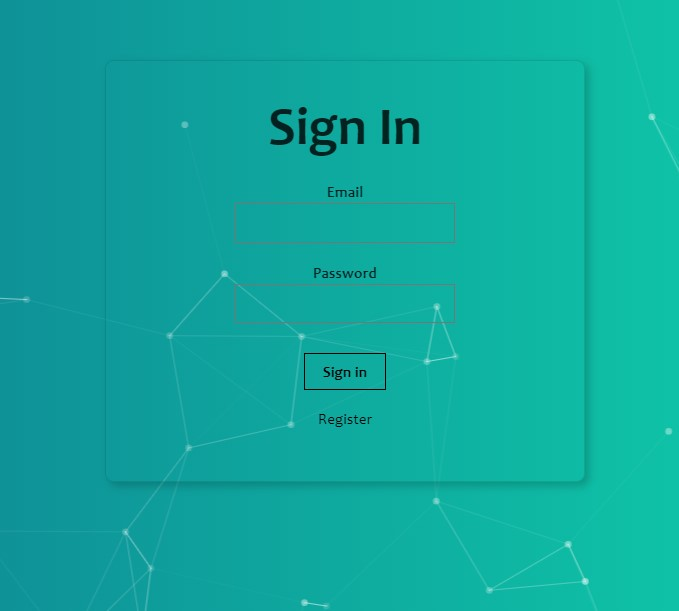
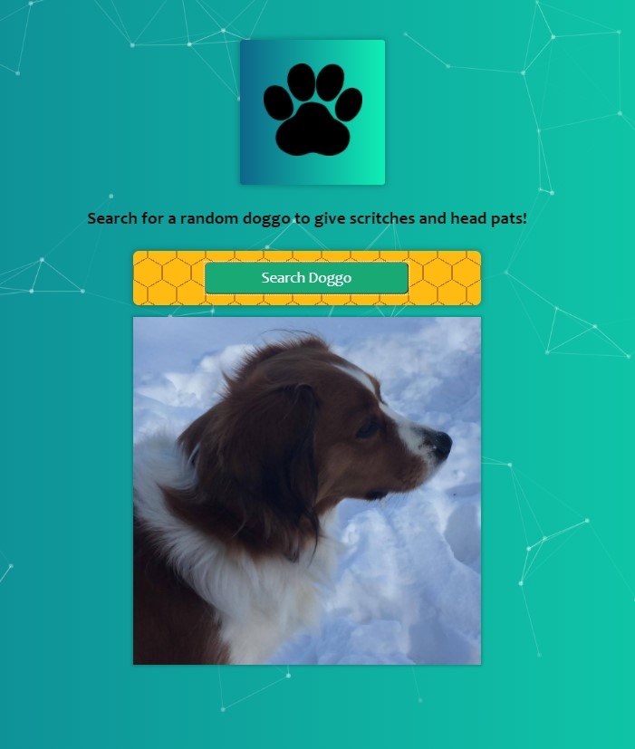

# Random Dog Searcher

Created using ReactJS, HTML5 and CSS.

## Installation

1. Clone the repostory

    ### `git clone `

2. Inside the project directory configure the back-end.
   ### `cd back_end`
   Install all modules.
   ### `npm install`
   Start the server
   ### `npm start`
3. Inside the project directory configure the front-end
    ### `cd back_end`
    Install all modules.
    ### `npm install`
    Start the server
    ### `npm start`

## Test Credentials:
```
Email: JohnWick@gmail.com
Password: Somepw
```

## App Preview
### Sign-in Page


### Home Page


# License: MIT